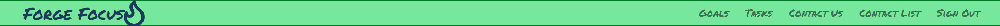
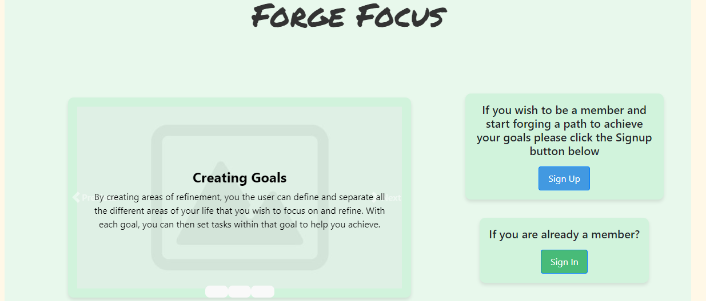
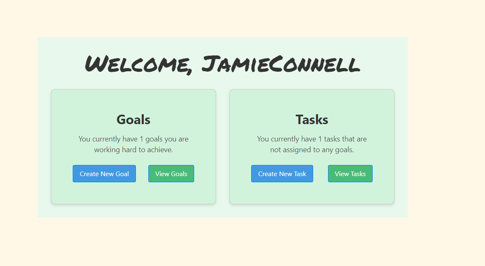

# Forge Focus
## Created By Jamie Connell 
## Student of CodeInstitute 2024

### Insert Responsivie image when ready

Forge Focus is a task management application that allows users to creatre, manage and orgasnise goals that they wish to acieve.
These goals can be everyday goals, or more spesific to a certain apect of the users live.

## Contents

- [Design](#Design)
    - [The Strategy Plane](#The-Strategy-Plane)
    - [The Scope Plane](#The-Scope-Plane)
    - [The Skeleton Plane](#The-Design-Plane)
    - [The Surface Plane](#The-Surface-Plane)
    - [Agile Methodology](#Agile-Methodology)
- [Features](#Features)
    - [Homepage](#HomePage)
    - [NavBar](#NavBar)
    - [User Authentication](#User-Authentication)
    - [Signup](#Signup)
    - [Login](#Login)
    - [Logout](#Logout)
    - [Goals](#Goals)
    - [Steps](#Steps)
    - [User Messages](#User-Messages)
    - [Contact Form](#Contact-Form)
    - [Search Goals](#Search-Goals)
- [Future Features](#Future-Features)
    - [Edit/Delete User Profiles](#Edit/Delete-User-Profiles)
    - [Improved Navigation](#Improved-Navigation)
    - [Rank Goals](#Rank-Goals)
- [Languages Used](#Languages-Used)
- [FrameWorks and Libraries Used](#Frameworks-and-Libraries-Used)
- [Technologies and Tools Used](#Technologies-and-tools-used)
- [Validation and Testing](#Validation-and-Testing)
- [Bugs/fixes](#Bugs/fixes)
- [Creating/Deployment](#Creating/Deployment)
    - [Create Repository](#Create-Repository)
    - [Cloning Repository](#Cloning-Repository)
    - [Forking Repository](#Forking-Repositiry)
    - [Connecting to backend API](#Connecting-to-backend-API)
    - [CodeInstitute SQL](#CodeInstitute-SQL)
    - [Deploying Using Heroku](#Deploying-Using-Heroku)
    - [Creating Django backend API](#Creating-Django-Backend-API)
- [Credits](#Credits)
    - [Content](#Content)
    - [Code](#Code)
- [Acknowledgements](#Acknowledgements)

# Design

## The Strategy Plane
Intended User Group The intended user group are those individuals who wish to achieve and focus on areas of their life aiding in them keeping track 
and on top of things the the user wishes to achieve.

User Background Issues For those with a very busy and sometimes un manageable full life and are unable to strive to things they want to achieve despite their determination to keep on top of things. which then leads to things in their live getting missed. Without a way to maintain organization within their life, users concentration can falter in areas resulting in these areas being difficult to maintain and eventually all progress being lost.

**Issue Statement**

"I am an extremely busy individual who is finding it difficult to keep track of everything I need to do and the extra things I wish I could do to help me progress in life.

Application Aim To provide busy individuals with an application which will allow them to store and manipulate data such as:

- Data that identifies the different areas in life that the user wishes to set goals for.
- Set tasks to aid in achieving this.
- Data that can be tracked and deadline dates set.

**Considerations to take into account**
- The data belonging to a user must be kept safe at all times, ensuring that the signed in user can only view and edit their own and can't access other users data and other users can't access the signed in user.

## The Scope Plane
For users this application will provide a secure React front-end application which will enable a signed in user to easily interact and create data belonging to that particular signed in user. The users data will be stored in a backend database controlled and served by the Django Rest Famework API.

The details of the scope of this project from a users point of view can be listed down below.

**Experience**
- As a new user, I can instantly see information about the application, so that I can understand the value that it may offer me.
- As a new user, I can find out more about the organizing side of the application, so that I can learn more about how the application works enticing me to sign up.
- As a new user, I can find out more about the taking steps side of the application, so that I can learn more about how the application works enticing me to sign up.

**Navigation**
- As a user, a clear navigation bar is present throughout the site, so that I can navigate easily between different sections of the application.
- As a user, the navigation bar contains links which are specific to whether I am logged in or logged out, so that all available links are relevant and accessible to me.
- As a user, navigation between different sections of the website is seamless without un-necessary page refreshing, so that I can navigate quickly around the site.
- As an authorized user, all sub pages include an x that will return me to my previous page on clicking, so that I can easily check things out and then return to where I was.
- As an authorized user, clicking on a task within the ‘take action’ page will take me to the ‘organize’ page where that assignment is located.

**Authentication**
- As a new user, I can easily set up an account, so that I can quickly get stuck into exploring and using the application.
- As a signed-up user, I can use my username and password to sign in to my account, so that my account remains secure and only I can login.
- As a signed-up user, I am the only one who can access my data, so that it remains safe and secure.
- As a signed-up user, I can reset my password, so that I can still access my account even if I have forgotten my password.
- As an authenticated user, I can easily logout of my account, so that I can keep my account secure.
- As an authenticated user, I can maintain my authenticated status until I choose to log out, so that I am not unexpectedly logged out due to expired access tokens.
- As an authenticated user, I can edit my user information, so that I can make changes to my username and password, helping me to keep my account secure.
- As an authenticated user, I can delete my data including my user data, so that I can remove all my data from the system should I wish to.

**Goals areas**
- As an authenticated user, I can create a goal, so that I can set out the different areas in my life that I want to use this app to support with and why each area is important to me.
- As an authenticated user, I can edit a goal, so that I can make changes should I wish.
- As an authenticated user, I can delete a goal, so that I can remove information I no longer need or want.

**Tasks**
- As an authenticated user, I can create tasks that can be linked to a goal or be used indepentantly, so that I can set myself progression targets that are specific, measurable, achievable, reachable and time-bound, defining the value to be gained in achieving the task.
- As an authenticated user, I can edit a task so that I can make changes should I wish.
- As an authenticated user, I can delete a task, so that I can remove information I no longer need or want.

**Informed User**
- As an authenticated user, I receive a success message on creation, editing and deleting, so that I know my action was successful.
- As an authenticated user, I receive a confirmation message on clicking to delete, so that I am made aware of any linked information that will also be deleted should I proceed and can avoid any accidental deletes.
- As an authenticated user, I receive a confirmation message when an action will result in form input updates remaining unsaved, so that I don’t accidentally lose data I meant to save.

## The Structure Plane
## The Skeleton Plane
## The Surface Plane
## Agile Methodology

# Features

## NavBar

The MainNavbar component is a crucial part of the Forge Focus application, 
providing intuitive navigation and user-specific actions. 

below images are how the navbar displays depending on userstate:

Navbar when user not signed in

Navbar when regular user is signed in

Navbar when superuser is signed in

**You will notice that there is an extra nav link for the superuser**

Key features of the navbar include:

1. Responsive Design:
- Utilizes React Bootstrap for a mobile-friendly, collapsible menu
- Custom styling with CSS modules for a unique look and feel

2. Dynamic Content:
- Adapts navigation options based on user authentication status
- Displays different links for logged-in and logged-out users

3. Branding:
- Features the "Forge Focus" logo with an animated flame icon
- Logo acts as a home button, directing to dashboard or landing page based on user status

4. Authentication Integration:

- Implements sign-out functionality with proper token management
- Uses custom hooks (useCurrentUser and useSetCurrentUser) for user state management

5. Navigation Links:
- For logged-in users: Goals, Tasks, Contact Us, and Sign Out
- For logged-out users: Login, Signup, and Contact Us

6. Styling:
- Uses Lucide React icons for visual enhancements
- Implements custom CSS modules for scoped styling

This NavBar component ensures a seamless and intuitive navigation experience, 
adapting to the user's authentication status and providing easy access 
to key features of the Forge Focus application.

## AboutPage

About Page Details

  The About page serves as the landing page for Forge Focus.
  Key Features of the About Page Include:

  1. **Interactive Carousel**: A visually engaging carousel that introduces user to the
  core concepts of the Forge Focus application:
  - Welcome message emphasizing the app's purpose
  - Overview of the app's functionality
  - Explanation of the goal creation process
  - Explanation of the task creation and how
  to link tasks to goals.

  2. User-Friendly Navigation: Clear calls-to-action for both new and returning users:

  - "Sign Up" button for new users to create an account
  - "Sign In" button for existing members to access their dashboard

  3. Responsive Design: Utilizes React Bootstrap components to ensure a seamless experience across different devices and screen sizes.
  Custom Styling: Implements a module-based CSS approach for maintainable and scoped styles.

  4. Custom Styling: Implements a module-based CSS approach for maintainable and scoped styles.

  The About page effectively Communicates the value proposition of Forge Focus, 
  encouraging users to take action and refining and achieving their personal goals
  through structured planning and task management.

## HomePage

The Home component serves as the main dashboard for the Forge Focus application. 
It provides users with an overview of their goals and tasks, 
as well as quick access to key features. 

An Image of the home page can be seen below:

Home Page Desktop view

Key aspects of this component include:

1. Authentication-based Content:
- Displays personalized content for logged-in users
- Shows a sign-in prompt for non-authenticated users

2. User Data Fetching:
- Utilizes custom hooks (useCurrentUser and useSetCurrentUser) for user state management
- Fetches user data on component mount if not already available

3. Dynamic Dashboard:
- Retrieves and displays the count of user's goals
- Shows the number of tasks not assigned to any goals
- Updates in real-time as the user interacts with the application

4. Quick Action Cards:
- Goals Card: Displays goal count and provides buttons to create new goals or view existing ones
- Tasks Card: Shows count of unassigned tasks with options to create new tasks or view all tasks

5. Responsive Design:
- Uses React Bootstrap components for a mobile-friendly layout
- Implements custom CSS modules for styled components

6. Navigation Integration:
- Utilizes React Router for seamless navigation between different sections of the app

7. Loading State Handling:
- Displays a loading indicator while fetching user data

8. Error Handling:
- Implements try-catch blocks to manage potential API request failures

This Home component provides users with a clear overview of their progress and 
easy access to the main features of Forge Focus, 
encouraging engagement with goal-setting and task management functionalities.

**Add Picture When Ready**

## User Authentication/ Not Authorized Page

Forge Focus implements an authentication and authorization system 
to ensure secure access to user-specific content. 
The system comprises several key components:

**ProtectedRoute Component**
- Acts as a wrapper for routes that require authentication
- Checks the user's authentication status
- Redirects unauthenticated users to the sign-in page
- Displays a loading state while determining user authentication status

**CurrentUserProvider Component**
- Manages the global state for the current user
- Utilizes React Context API for efficient state management
- Handles user authentication on initial load
- Implements token refresh mechanism to maintain user sessions
- Uses axios interceptors to handle authentication errors and token refreshing
- Provides the current user data and setter function to child components

**NotAuthorized Component**
- Displays a user-friendly message when access is denied
- Offers options to sign in or sign up
- Utilizes React Router for navigation to authentication pages

### Key Features:

1. Global State Management:
- Uses React Context for efficient sharing of user data across components

2. Token Refresh Mechanism:
- Automatically refreshes authentication tokens to maintain user sessions

3. Interceptors for API Requests:
- Handles 401 (Unauthorized) errors by attempting to refresh the token
- Redirects to sign-in page if token refresh fails

4. Protected Routes:
- Ensures that certain routes are only accessible to authenticated users

5. Loading State Handling:
- Displays loading indicator while fetching user data or determining authentication status

6. Error Handling:
- Gracefully handles authentication errors and network issues

7. User-Friendly Unauthorized Access Handling:
- Provides clear instructions and easy navigation options when access is denied

This authentication system ensures that Forge Focus maintains a secure environment 
where users can safely interact with their personal goal and task data, 
while providing a smooth user experience throughout the authentication process.

**Add in picture When Ready**

## Signup Page

The SignUp component provides a user-friendly interface for new users to create an account on Forge Focus. 
This component is essential for user onboarding and expanding the application's user base.

**Key features and functionalities:**

1. User Input Collection:
- Captures username, email, password, and password confirmation
- Uses controlled components for form inputs
- Real-time update of state as user types

- Form Validation and Submission:
- Prevents default form submission behavior
- Sends a POST request to the backend API for user registration
- Handles successful registration by navigating to the sign-in page

2. Comprehensive Error Handling:
- Displays field-specific validation errors returned from the server
- Shows non-field errors (general errors) as alerts
- Handles unexpected errors with a generic message

3. State Management:
- Utilizes React's useState hook for local state management
- Manages form data and error states separately

4. Success Feedback:
- Integrates with global success message hooks to provide feedback on successful registration

5. Navigation:
- Uses React Router's useNavigate hook for programmatic navigation after successful registration

6. Security Considerations:
- Password fields use type="password" for secure input
- Implements password confirmation to reduce the risk of typos

7. User Experience:
- Clearly labeled form fields with appropriate input types
- Immediate feedback on input errors

This SignUp component ensures a smooth and secure registration process for new Forge Focus users, 
integrating with the application's authentication system and providing 
a positive first interaction/experience with the application.

**Insert Image When Ready**

## Signin Page
The SignIn component provides a user interface for existing users to authenticate 
and access their Forge Focus account. This component is crucial 
for the application's security and user experience.

**Key features and functionalities:**

1. User Input Handling:
- Collects username and password from the user
- Uses controlled components for form inputs
- Real-time update of state as user types

2. Form Submission:
- Prevents default form submission behavior
- Sends a POST request to the backend API for authentication
- Handles successful login by updating the current user state and navigating to the home page

3. Error Handling:
- Displays validation errors returned from the server
- Shows password-related errors as alerts

4. State Management:
- Utilizes React's useState hook for local state management
- Integrates with custom hooks for global state management (useSetCurrentUser, useCurrentUser)

5. Authentication Flow:
- Sets authentication tokens upon successful login
- Updates the global user state with the logged-in user's information

6. Redirection:
- Uses a custom hook (useRedirect) to prevent already logged-in users from accessing the sign-in page

7. Success Feedback:
- Utilizes global success message hooks to provide feedback on successful sign-in

8. Security Considerations:
- Password field uses type="password" for secure input
- Integrates with backend API authentication system for secure credential verification

This SignIn component ensures a smooth and secure authentication process for Forge Focus users, 
integrating with the application's overall authentication and authorization system.

**Insert Image When Ready**

## Main Goals Area

The Main Goals Area is a crucial part of the Forge Focus application, 
providing users with a comprehensive view and management interface for their goals. 
This component offers a rich set of features to enhance user interaction with their goal data.

**Some of the Key Features of the Main Goals Area are as follows:**

1. **Goal Fetching and Display**
   - Automatically fetches and displays the user's goals upon component mount
   - Presents goals in an easy-to-view grid layout

2. **Search Functionality**
   - Allows users to search through their goals by name
   - Implements real-time filtering as the user types

3. **Pagination**
   - Displays goals in manageable chunks (6 goals per page)
   - Provides intuitive navigation between pages of goals

4. **Create New Goal**
   - Offers a direct link to create a new goal, enhancing user workflow

5. **Navigation**
   - Includes a 'Back' button for easy navigation to the previous page

6. **Responsive Design**
   - Utilizes custom CSS modules for a responsive and visually appealing layout

7. **Dynamic Content Loading**
   - Displays a loading message while fetching goal data
   - Shows a message when no goals match the search criteria

8. **Error Handling**
   - Redirects to sign-in page if the user's session has expired
   - Navigates to the home page for certain error conditions (e.g., forbidden access)

9. **Goal Preview**
   - Each goal is displayed using a GoalsView component, showing key information like name, image, and associated tasks count

This component forms a core part of the user interface, 
allowing users to effectively manage and interact with their goals.

## Goal Details Page

The Goals Details component provides users with a detailed view of a specific goal and its associated tasks. 
This component offers a comprehensive interface for users to view and manage individual goal information.

**Some of the Key Features of the Main Goals Area are as follows:**

1. **Dynamic Goal Fetching**
   - Automatically fetches goal details based on the goal ID from the URL parameters
   - Displays loading state while fetching data

2. **Comprehensive Goal Information Display**
   - Shows the goal's name, image, and reason
   - Presents a list of tasks associated with the goal

3. **Task Management**
   - Displays all tasks linked to the goal
   - Shows a message when no tasks are associated with the goal

4. **Goal Management Options**
   - Provides buttons to edit or delete the current goal
   - Uses React Router for seamless navigation to edit and delete pages

5. **Error Handling**
   - Implements error logging for failed data fetching

6. **Responsive Design**
   - Utilizes a simple, clean layout for easy viewing on various devices

This component aids in the user interface, allowing users to dive deep into the details of each goal, view associated tasks, and take actions like editing or deleting the goal. It supports the core functionality of goal management within the application.

## Create New Goal

The GoalsCreate component allows users to create new goals. 
This component provides an intuitive interface for users to input goal details 
and upload an associated image.

**Some of the Key Features of the Main Goals Area are as follows:**

1. **Goal Information Input**
- Allows users to enter a name for their goal
- Provides a field for users to explain the reason or importance of the goal

2. **Image Upload**
- Enables users to upload an image associated with their goal
- Displays a preview of the selected image or a default image

3. **Form Submission**
- Handles the creation of a new goal by sending data to the server
- Uses FormData to handle both text inputs and file upload

4. **Navigation**
- Includes a cancel button that redirects users to the home page
- Automatically navigates to the goals area upon successful goal creation

5. **User Feedback**
- Utilizes a global success message system to inform users of successful goal creation

6. **Error Handling**
- Implements basic error logging for failed goal creation attempts

This component aids in the goal-setting process, allowing users to easily create and define new goals, 
supporting the application's core functionality of personal development and task management.

## Edit Goal

The GoalsEdit component allows users to modify existing goals. This component provides an intuitive interface for users to update goal details and view the associated image.

**Some of the Key Features of the Main Goals Area are as follows:**

1. **Dynamic Goal Data Fetching**
   - Automatically fetches the current goal data based on the goal ID from URL parameters
   - Populates form fields with existing goal information

2. **Goal Information Editing**
   - Allows users to modify the goal's name and reason
   - Displays the current goal image (without the ability to change it in this version)

3. **Form Submission**
   - Handles the update of an existing goal by sending data to the server
   - Uses FormData to package the updated information

4. **Navigation and State Management**
   - Includes a cancel button that returns to the view state without saving changes
   - Navigates back to the goals area upon successful update
   - Optionally updates parent component state (setGoalData and setGoalState)

5. **User Feedback**
   - Utilizes a global success message system to inform users of successful goal updates
   - Displays error messages for each form field if validation fails

6. **Error Handling**
   - Implements error logging for failed data fetching and update attempts
   - Redirects to appropriate pages based on error types (e.g., unauthorized, forbidden, not found)

7. **Loading State**
   - Displays a loading message while fetching goal data

This component aids in the goal management process, allowing users to easily update and 
refine their goals as their needs and aspirations evolve.

## Delete Goal

The GoalsDelete component provides users with a secure and informative interface for deleting existing goals. This component ensures users are fully aware of the consequences of their actions before proceeding with goal deletion.

**Some of the Key Features of the Main Goals Area are as follows:**

1. **Goal Information Retrieval**
   - Automatically fetches the goal's name and associated tasks count based on the goal ID from URL parameters
   - Displays the goal name in the confirmation message for user clarity

2. **Associated Tasks Warning**
   - Informs users about the number of tasks that will be deleted along with the goal
   - Helps prevent accidental loss of important task data

3. **Confirmation Interface**
   - Presents a clear confirmation message asking users if they're sure about deleting the goal
   - Provides both "Cancel" and "Delete" options for user decision

4. **Delete Functionality**
   - Handles the deletion of the goal by sending a delete request to the server
   - Navigates back to the goals area upon successful deletion

5. **User Feedback**
   - Utilizes a global success message system to inform users of successful goal deletion
   - Displays the success message returned from the server

6. **Error Handling**
   - Implements error logging for failed data fetching and deletion attempts

7. **Navigation**
   - Includes a cancel option that returns to the goal details page without deleting
   - Uses React Router for seamless navigation between pages

### Safety Considerations:

- Double confirmation process (navigating to delete page + confirming deletion) helps prevent accidental deletions
- Displays the goal name in the confirmation message to ensure users are deleting the correct goal

This component aids in the goal management process, allowing users to safely remove goals that are no longer relevant while being fully informed of the consequences.

## Main Tasks Area
## Task Details Page
## Search Goals
## Create New Task
## Edit Task
## Delete Task

## User Messages

The User Message System in Forge Focus provides a centralized mechanism for displaying success messages 
to users across the application. This system is implemented using React's Context API 
and consists of the GlobalMessageProvider component along with several custom hooks.

**Key features and functionalities:**

1. Context Creation:
Four separate contexts are created to manage the state and setters for global success messages:
- ShowGlobalSuccessContext
- SetShowGlobalSuccessContext
- GlobalSuccessMessageContext
- SetGlobalSuccessMessageContext

2. State Management:
Uses React's useState hook via useGloabalSuccess.js to manage:
- showGlobalSuccess: boolean to control message visibility
- globalSuccessMessage: string containing the message content

3. Auto-hide Functionality:
- Implements a useEffect hook to automatically hide the success message after 5 seconds
- Clears the message content when hiding to prevent stale messages

4. Prop Types Validation:
- Utilizes PropTypes to ensure that the provider receives the expected children prop

5. Context Provider Nesting:
- Nests multiple context providers to make both state and setter functions available throughout the component tree

6. Usage in Components:
Allows any component in the application to:
- Display a success message
- Set the message content
- Control the visibility of the message

7. Integration with App Structure:
- Designed to work with a 'SuccessMessage' component nested within App.js

8. Flexibility:

Can be easily extended to handle different types of messages (e.g., error, warning) by adding additional contexts
- This Global Message System enhances the user experience in Forge Focus by providing a consistent and 
- centralized way to display important feedback to users. 
- It's particularly useful for confirming successful actions like form submissions, data updates, or completed processes.

## Contact Form

The ContactForm component provides a user interface for users to send messages or inquiries to the Forge Focus team. 
This component is designed to collect user feedback and facilitate communication between users and administrators.

**Key features and functionalities:**

1. User Input Collection:
- Captures user's name, email, and message
- Uses controlled components for form inputs
- Real-time update of state as user types

3. Form Submission:
- Prevents default form submission behavior
- Sends a POST request to the backend API ("/contact/" endpoint)
- Handles successful submission by showing a success message and navigating to the home page

4. Error Handling:
- Displays field-specific validation errors returned from the server
- Shows non-field errors (general errors) as alerts

5. State Management:
- Utilizes React's useState hook for local state management
- Manages form data and error states separately

6. Success Feedback:
- Integrates with global success message hooks to provide feedback on successful form submission

7. Navigation:
- Uses React Router's useNavigate hook for programmatic navigation after successful submission

8. Accessibility:
- Implements screen reader-only labels for form inputs

9. User Experience:
- Clear, simple layout with centered content
- Immediate feedback on input errors

**Important Note:** 
Currently, the submitted contact form data can only be viewed by an admin user logged in directly to the backend API admin interface. 
This limitation means that regular users or front-end administrators cannot access or manage 
the submitted contact messages through the main application interface.

**Future Enhancements:**
- Implement a front-end interface for authorized users to view and manage contact submissions
- Add email notifications for new contact form submissions

This ContactForm component provides a straightforward way for users to reach out to the Forge Focus admin, 
enhancing user engagement and support capabilities of the platform.

# Future Features
Some Future features that I have considered for the development of the 
Forge Focus Application are as follows.

## Implement task creation directly from goal details page.
## Include goal progress tracking or completion status on goal details page.

## Add User Profiles
Allow users to create detailed profiles, showcasing their goals, achievements, and personal information. 
This feature will enhance user engagement and personalization within the platform.

## Edit/Delete User Profiles
Provide users with the ability to modify or remove their profile information, 
ensuring they have full control over their personal data and online presence within the application.

## Improved User Navigation
Enhance the user interface with more intuitive navigation options, making it easier for users 
to move between different sections of the application and access their goals and tasks more efficiently.

## Rank Goals
Implement a system for users to prioritize their goals, helping them focus on what's most important. 
This feature will include options to set high, medium, and low priority levels for each goal.

## Connect with other Users
Introduce some form of social networking capabilities, allowing users to connect with like-minded individuals, 
share their progress, and offer mutual support in achieving their goals.

## Team Goals With Other Users
Enable collaborative goal-setting, where users can create shared goals with friends, 
family, or colleagues. This feature will promote teamwork and mutual accountability.

## Message System to communicate to other users
Develop an in-app messaging system, facilitating direct communication between users. 
This will support collaboration on shared goals and foster a community of mutual support and motivation.

These possible future features would help the application be a better
tool for a users personal development and goal achievement.

# Technologies/ Lanuages used

Forge Focus uses a variety of modern web development technologies to create the
React application. It uses the combination of Vite for fast builds, React for
UI components, and testing tools. All of which are listed below.

## Languages Used

- JavaScript: The primary language used for both frontend and build tools
- JSX: A syntax extension for JavaScript used with React
- HTML: Markup language for structuring web content
- CSS: Style sheet language for describing the presentation of web content

## FrameWorks and Libraries Used

- React Router: Declarative routing for React applications
- React Bootstrap: Bootstrap components built with React
- Axios: Promise-based HTTP client for the browser and Node.js
- JWT Decode: Library to decode JWTs token which are Base64Url encoded
- Lucide React: Beautiful & consistent icon toolkit made by the community
- Prop Types: Runtime type checking for React props

## Technologies and Tools Used

- React: A JavaScript library for building user interfaces
- Vite: Next generation frontend tooling
- Node.js: JavaScript runtime built on Chrome's V8 JavaScript engine

## Validation and Testing

- React Testing Library: Simple and complete testing utilities for React
- Jest DOM: Custom Jest matchers to test the state of the DOM
- User Event: Library for simulating user events for testing

## Deployment

- Serve: Static file serving and directory listing
- Heroku: Cloud platform for deploying and running modern apps

## Bugs/fixes

The bugs below were identified during the development of The Forge Focus application.
For ease of reading I have attempted to split the bugs into their associated features.

### HomePage

Click Arrow to see bugs related to HomePage

| Bug Description | Errors displayed | Steps Taken to Fix | Is bug Fixed (Y/N) |

### NavBar

Click Arrow to see bugs related to NavBar

| Bug Description | Errors displayed | Steps Taken to Fix | Is bug Fixed (Y/N) |
| NavBar attempting to fetch user data without usersigned in | current error code displayed on developer console - GET 403 (Forbidden) | I was able to fix the issue as i noticed that i did not make sure that the "FetchUserData" function was only called when the "currentUser" was not null. By making this change the error/bug was resolved | bug now fixed |
|when user is signed in nav bar items do not change| nav items not change | to fill in| error to be fixed|

### User Authentication

Click Arrow to see bugs related to User Authentication

| Bug Description | Errors displayed | Steps Taken to Fix | Is bug Fixed (Y/N) |

### Signup Page

Click Arrow to see bugs related to SignUp Page

| Bug Description | Errors displayed | Steps Taken to Fix | Is bug Fixed (Y/N) |
|--|--|--|--|
| When attempting to signup as a user, a 500 internal error would display in the console but when API Checked within backend the user has been created. | 500 (Internal Server Error) handleSubmit@ Signup.jsx:30  | with the help with the following link from stack overflow, the issue has now been resolved and the error now does not display | Bug is now fixed|

### Signin Page

Click Arrow to see bugs related to SignIn Page

| Bug Description | Errors displayed | Steps Taken to Fix | Is bug Fixed (Y/N) |
| When attempting to sign in, the developer console displayed an error and the page did not redirect as intended, however when refreshed showed user as logged in | Access token is missing in the response | Still attempting to fix | bug not fixed |

### Goals

Click Arrow to see bugs related to Goals

| Bug Description | Errors displayed | Steps Taken to Fix | Is bug Fixed (Y/N) |
| When creating new goals console retunrs CORS Error | has been blocked by CORS policy: Response to preflight request doesn't pass access control check: No 'Access-Control-Allow-Origin' header is present on the requested resource. | Will have to do a bit more research into CORS to try resolve the issue | Bug to be fixed |

### Steps

Click Arrow to see bugs related to Steps

| Bug Description | Errors displayed | Steps Taken to Fix | Is bug Fixed (Y/N) |

### User Messages

Click Arrow to see bugs related to User Messages

| Bug Description | Errors displayed | Steps Taken to Fix | Is bug Fixed (Y/N) |

### Search Goals

Click Arrow to see bugs related to Search Goals

| Bug Description | Errors displayed | Steps Taken to Fix | Is bug Fixed (Y/N) |

### Contact Form

Click Arrow to see bugs related to Contact Form

| Bug Description | Errors displayed | Steps Taken to Fix | Is bug Fixed (Y/N) |

# Creating/Deployment

## Create Repository
The repository was created using Github. with my previous projects as a student this was done using a template provided by Code Institute. 
However this time I did not use a template and used the following steps to create the Forge Focus Repository:

- Headover to [Github](www.github.com) and signin using your credentials.
- Once Signed in Click Repositories tab.
- At the top right handside of your list of repositories you will see a "new" button, Click this button.
- You will then be brought to the new repositories page where can give your repository a name (for this I used "Forge-Focus-PP5-Frontend).
- There is an optional description box if you wish to give a bit more detail to your repository.
- Then Click on the green "create repository" and Github will create the new repository.

## Cloning Repository

Github can also be used to clone a repository so that the code can be altered and pushed back to the main repository using a different IDE.

This can be done by using the following steps.

1. In the "Forge-Focus-PP5-Frontend" repository, select the green "code" tab.
2. Select HTTPS in the dropdown menu.
3. Copy the URL under HTTPS.
4. There are 2 main virtual IDE's that CodeInstitiue reccomend and those are CodeAnyWhere and GitPod.

Please Note that the images used for CodeAnywhere were images used in a previous project entitled Story-time-Adventures-PP3 the process however remains the same.

**Cloning Repository Using CodeAnywhere**
1. Open the CodeAnywhere.
2. Sign in using your Github details.
3. codeanywhere sign in
4. Click on the create new workspace button.
5. Paste copied HTTPS and click create (Codeanywhere will now generate the virtual IDE).
6. Once IDE has Loaded create inital index.html page and add test text.
7. Once test text is added press Ctrl + S to save.
8. Click terminal tab at top of screen and click new terminal.
9. Once new terminal has opened test that content is being pushed back to github.
10. In the terminal type git add . and press enter (this will add all new content).
11. Then type git commit -m "add test text" and press enter (this lets anyone seeing your commits know what you have done).
12. Once you have done that type git push and press enter (this will push all changes made to the github repository).
13. Navigate to github.
14. Choose the repository you were working on.
15. Check the changes have been successfully pushed.

**Cloning Repository Usining Gitpod**
1. Open GitPod
2. Click the signin/ Login button at the top right hand corner of the page.
3. Sign/Login using your GitHub credentials.
4. Click on New Workspace
5. Gitpod works slightly different from Codeanywhere, you can either begin typing the name of your repository and you will see it appear in the dropdown menu or you can simply paste the copied HTTPS in to the field.
6. Click Continue and you Gitpod virtual workspace will be created.
7. Once IDE has Loaded create inital index.html page and add test text.
8. Once test text is added press Ctrl + S to save.
9. Click terminal tab at top of screen and click new terminal.
10. Once new terminal has opened test that content is being pushed back to github.
11. In the terminal type git add . and press enter (this will add all new content).
12. Then type git commit -m "add test text" and press enter (this lets anyone seeing your commits know what you have done).
13. Once you have done that type git push and press enter (this will push all changes made to the github repository).
14. Navigate to github.
15. Choose the repository you were working on.
16. Check the changes have been successfully pushed.

# Please Note
If for what ever reason you find yourself switching between CodeAnywhere or Gitpod please make sure that the first command in your terminal is "git pull" as this will pull any changes that you have made using other IDE's.

## Forking Repository

## Creating React Application

## Connecting to backend API

## CodeInstitute SQL

## Deploying Using Heroku

## Creating Django backend API

# Credits

## Content

## Code

# Acknowledgements
