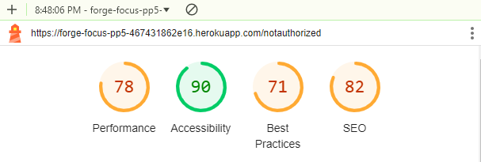

# Testing and Validation

## Contents

[Code Validation](#code-validation)

[User Story Testing](#user-story-testing)

[Form input testing](#form-input-testing)

[Accessibility Testing](#accessibility-testing)

[Lighthouse](#lighthouse)

[Responsive Testing](#responsive-testing)

[Compatibility Testing](#compatibility-testing)

---

## Code Validation

### JavaScript Validation

EsLint was installed and in use during building of this project and has been used to validate all the JavaScript files, the majority of which are in .JSX format All files pass through the EsLint without warning.

### CSS Validation

All css files have been passed through the [W3C CSS Validation Service](https://jigsaw.w3.org/css-validator/)

| CSS file | Result | Extra notes |
| --- | --- | --- |
| About.module.css | PASS | |
| Home.module.css | PASS | |
| Form.module.css | PASS | |
| Footer.module.css | PASS | |
| Goal.module.css | PASS | |
| GoalCreate.module.css | PASS | |
| MainNavBar.module.css | PASS | |
| Page.module.css | PASS | |
| TaskArea.module.css | PASS | |

## User Story Testing 

| Test Case                                           | Objective                                                                                              | Steps                                                                                       | Expected Outcome                                                                             | Actual Outcome               |
|-----------------------------------------------------|--------------------------------------------------------------------------------------------------------|---------------------------------------------------------------------------------------------|---------------------------------------------------------------------------------------------|------------------------------|
| View Application Information                         | Verify that new users can see information about the application.                                      | 1. Open the application homepage.   2. Observe the content displayed.                   | The homepage clearly presents information about the application’s value.                    | PASS                         |
| Access Organizing Information                        | Ensure new users can find organizing information.                                                     | 1. Navigate to the "Organize" section from the homepage.                                   | Users can view detailed information on organizing features.                                 | PASS                         |
| Access Taking Steps Information                      | Ensure new users can find information about taking steps.                                            | 1. Navigate to the "Take Action" section from the homepage.                                 | Users can view detailed information on taking steps features.                               | PASS                         |
| Navigation Bar Presence                              | Verify that the navigation bar is present throughout the site.                                       | 1. Open different sections of the application.                                             | A clear navigation bar is present in all sections.                                         | PASS                         |
| Navigation Bar Links for Logged In/Out Users       | Ensure links are relevant based on login status.                                                      | 1. Log out of the application.   2. Check the navigation links.   3. Log in and check links again. | Links change appropriately based on login status.                                          | PASS                         |
| Seamless Navigation                                  | Verify that navigation between sections is seamless.                                                  | 1. Click on various links in the navigation bar.                                           | Navigation occurs without unnecessary page refreshing.                                      | PASS                         |
| Return to Previous Page                              | Check if authorized users can return to the previous page.                                           | 1. Log in as an authorized user.   2. Navigate to a subpage.   3. Click on the "X" to return. | User is taken back to the previous page.                                                    | PASS                         |
| Navigate to Organize from Take Action                | Ensure clicking a task leads to the correct page.                                                    | 1. Log in as an authorized user.   2. Navigate to the "Take Action" page.   3. Click on a task. | User is redirected to the relevant "Organize" page.                                        | PASS                         |
| Account Setup                                       | Verify new user can set up an account easily.                                                         | 1. Go to the signup page.   2. Fill in the registration form.   3. Submit the form.  | User receives confirmation of successful account creation.                                  | PASS                         |
| Sign In                                             | Ensure signed-up users can log in.                                                                     | 1. Navigate to the login page.   2. Enter username and password.   3. Submit the login form. | User is logged in and redirected to the dashboard.                                         | PASS                         |
| Data Security                                       | Verify that user data is secure and accessible only by the user.                                      | 1. Log in with valid credentials.   2. Attempt to access another user’s data.          | Access is denied.                                                                           | PASS                         |
| Password Reset                                      | Ensure users can reset their passwords.                                                                | 1. Go to the password reset page.   2. Enter registered email and submit.               | User receives a password reset email.                                                      | PASS                         |
| Logout Functionality                                | Verify users can log out.                                                                               | 1. Log in as an authenticated user.   2. Click the logout button.                       | User is logged out and redirected to the homepage.                                         | PASS                         |
| Maintain Authenticated Status                        | Ensure authenticated users stay logged in.                                                             | 1. Log in as an authenticated user.   2. Wait for a period without logging out.         | User remains logged in until they choose to log out.                                       | PASS                         |
| Edit User Information                               | Verify users can edit their information.                                                                | 1. Log in as an authenticated user.   2. Navigate to user settings.   3. Edit user information. | Changes are saved successfully.                                                              | PASS                         |
| Delete User Data                                    | Ensure users can delete their data.                                                                     | 1. Log in as an authenticated user.   2. Navigate to the delete account option.   3. Confirm deletion. | User data is removed from the system.                                                      | PASS                         |
| Create a Goal                                       | Verify authenticated users can create a goal.                                                          | 1. Log in as an authenticated user.   2. Navigate to the goals section.   3. Fill in the goal creation form and submit. | Goal is created successfully.                                                                | PASS                         |
| Edit a Goal                                         | Ensure users can edit their goals.                                                                      | 1. Log in and navigate to goals.   2. Select an existing goal to edit.   3. Make changes and save. | Goal updates successfully.                                                                    | PASS                         |
| Delete a Goal                                       | Verify users can delete a goal.                                                                         | 1. Log in and navigate to goals.   2. Select a goal to delete.   3. Confirm deletion. | Goal is removed successfully.                                                                | PASS                         |
| Create a Task                                       | Ensure users can create tasks linked to a goal.                                                         | 1. Log in as an authenticated user.   2. Navigate to the tasks section.   3. Create a new task linked to a goal. | Task is created successfully.                                                                | PASS                         |
| Edit a Task                                         | Verify users can edit tasks.                                                                            | 1. Log in and navigate to tasks.   2. Select an existing task to edit.   3. Make changes and save. | Task updates successfully.                                                                    | PASS                         |
| Delete a Task                                       | Ensure users can delete a task.                                                                         | 1. Log in and navigate to tasks.   2. Select a task to delete.   3. Confirm deletion. | Task is removed successfully.                                                                 | PASS                         |
| Success Messages                                     | Verify success messages appear after actions.                                                           | 1. Perform create, edit, and delete actions on goals and tasks.                            | User receives success messages after each action.                                           | PASS                         |
| Confirmation Before Deletion                         | Ensure confirmation messages appear before deletion.                                                    | 1. Attempt to delete a goal or task.                                                         | User receives a confirmation message warning about linked information.                      | PASS                         |
| Unsaved Changes Warning                              | Check for warnings on unsaved changes.                                                                  | 1. Make changes in a form without saving.   2. Attempt to navigate away.                 | User receives a warning about unsaved changes.                                             | PASS                         |

## Form Input Testing

| Form | Handles change | Handles errors | Handles submit | Success message |
| --- | --- | --- | --- | --- |
| Signup | PASS | PASS | PASS | PASS |
| Signin | PASS | PASS | PASS | PASS |
| GoalsCreate | PASS | PASS | PASS | PASS |
| GoalsEdit | PASS | PASS | PASS | PASS |
| GoalDelete | PASS | PASS | PASS | PASS |
| TaskCreate | PASS | PASS | PASS | PASS |
| TaskEdit | PASS | PASS | PASS | PASS |
| TaskDelete | PASS | PASS | PASS | PASS |
| ContactForm | PASS | PASS | PASS | PASS |

## Accessibility Testing

The follwoing was used to testy the pages accessability

- Lighthouse
- Wave
- WCAG Contrast checker

The results for each can be seen below

**Lighthouse**

Sign in page

 

Sign up page

 

About Page

 

Homepage

 

Goals Area Page

 

Goals Details page

Goals Delete Page

Goals Edit Page

Tasks Area Page

Tasks Edit Page

Tasks Delete page

Contact Page

Contact List Page

**Wave Accessibility evaluation tool**

When The application was run through the Wave tool no errors were present.

**WCAG Contrast checker**

When The application was run through the WCAG Contrast checker.

# Responsive Testing 

Unfortunately due to timing constrants there was no time to do final Responsivity testing

Some pages shrink when in mobile view and again due to timing constrants this could not be fixed.

